# Bật thông báo

**CÁCH BẬT THÔNG BÁO TRÊN HỆ THỐNG ERP - TOURWELL**

**I. Trên IOS (các dòng máy Apple IPhone)**

**1. Truy cập trang web của bạn trên trình duyệt Safari trên thiết bị di động Apple trên 16.4+ (lưu ý phiên bản IOS)**

Truy cập và tiến hành đăng nhập vào tài khoản ERP đã được cấp

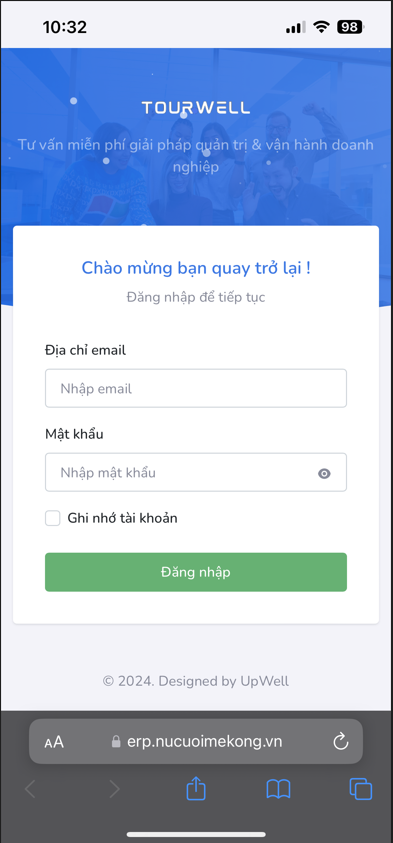

\
**2. Sau khi đăng nhập thành công nhấp vào nút chia sẻ của trình duyệt trên thiết bị di động**

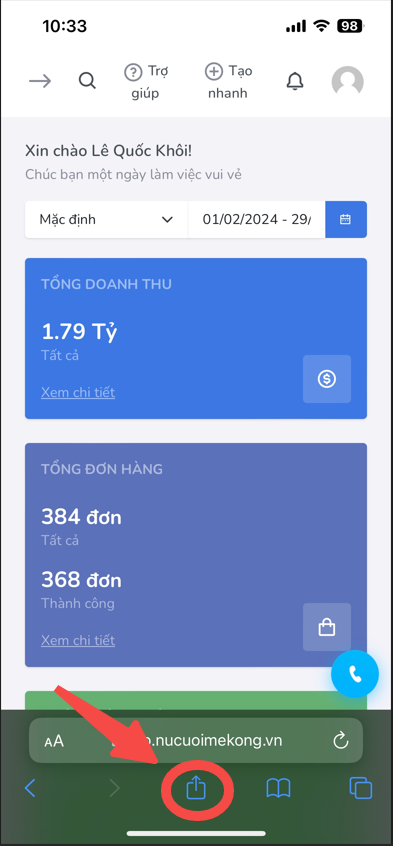

\
**3. Bấm vào tùy chọn Thêm vào màn hình chính (Hoặc Add to Home Screen đối với tiếng Anh)**

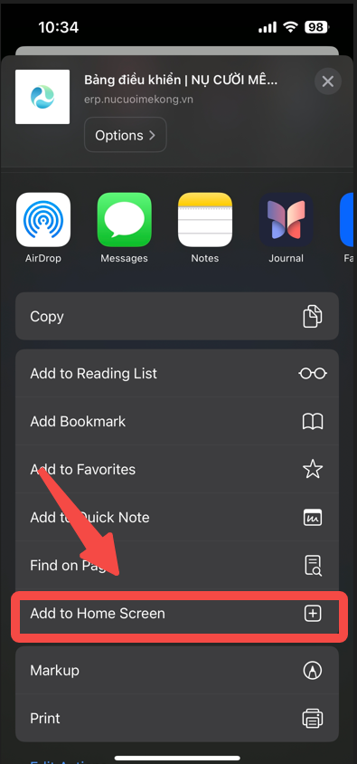

\
**4. Một hộp thoại xuất hiện, hãy lưu ý đường dẫn như hình và tiến hình bấm vào nút "Add"**

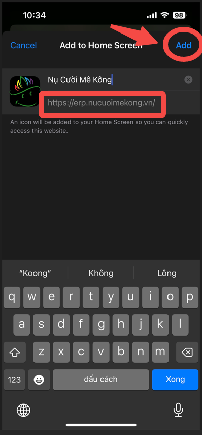

\
**5. Sau khi thực hiện bước trên, biểu tượng ứng dụng sẽ hiển thị ở màn hình chính của bạn**

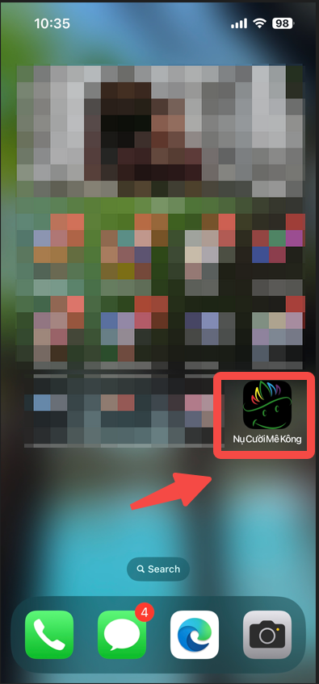

6\. **Mở ứng dụng từ màn hình chính để nhận thông báo từ chuông**

Bấm vào biểu tượng chuông

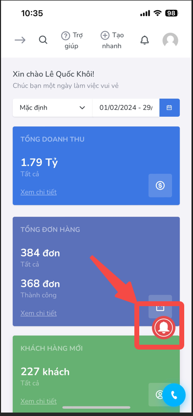

Tiếp tục ấn vào cho phép (Allow) để hoàn tất việc nhận thông báo của ERP trên IOS

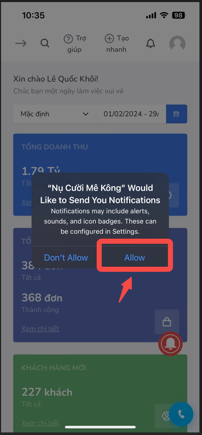

**II. Trên Android (các dòng điện thoại còn lại)**

Đăng nhập như bình thường vào tài khoản ERP được cấp, ở đây ta sử dụng trình duyệt Chrome của Google

Sau khi đăng nhập thành công, ấn vào biểu tượng chuông vào đỏ để nhận thông báo

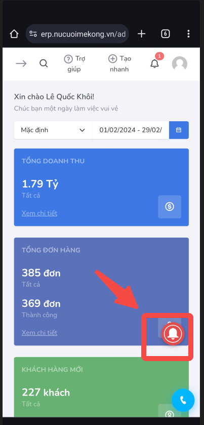

Tiếp tục ấn vào "Nhận thông báo" để hoàn tất việc nhận thông báo

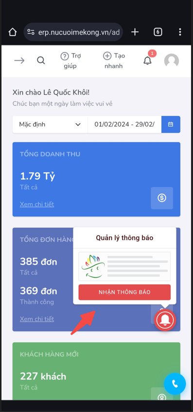

**III. Trên máy tính (laptop, desktop)**

Truy cập vào đường dẫn https://erp.nucuoimekong.vn/ và tiến hành đăng nhập

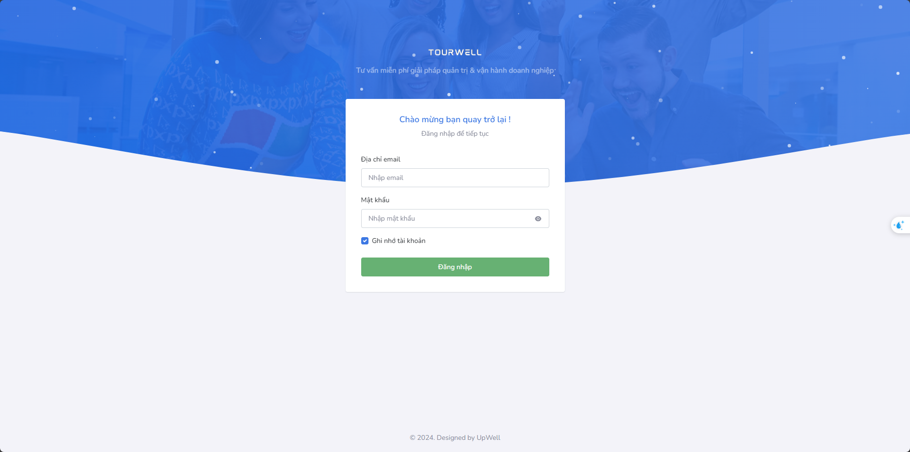

Sau khi đang nhập thành công ấn vào biểu tượng chuông vào đỏ ở góc dưới bên phải để đăng kí nhận thông báo

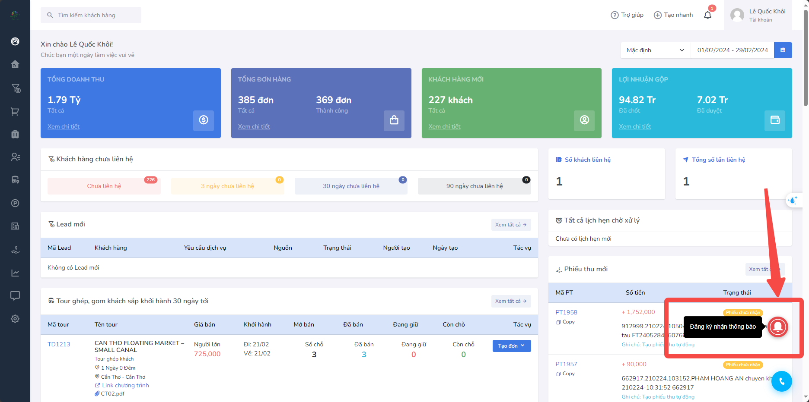

Sau đó sẽ có một hộp thoại hiện ra, click vào Allow (cho phép) để hoàn tất việc đăng kí nhận thông báo

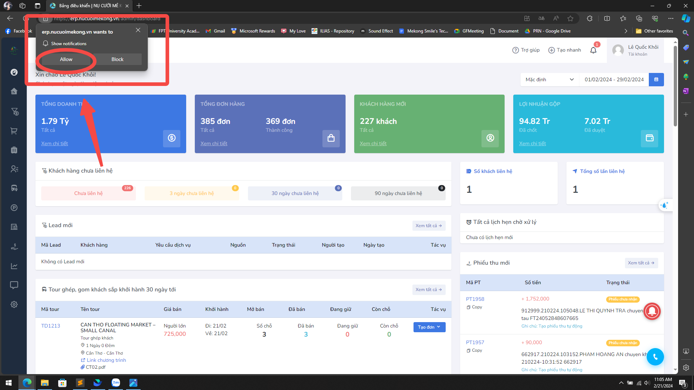
